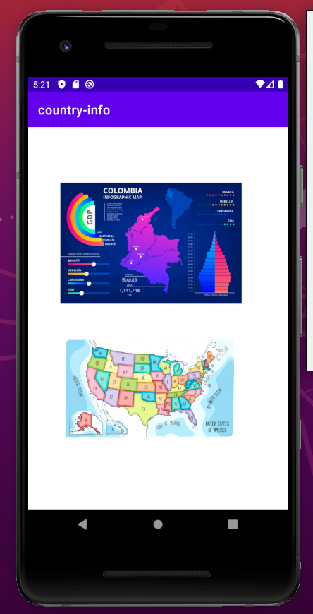
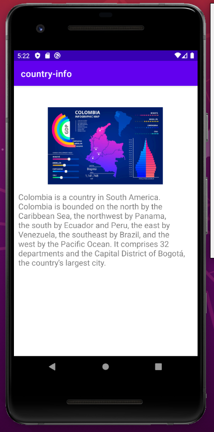
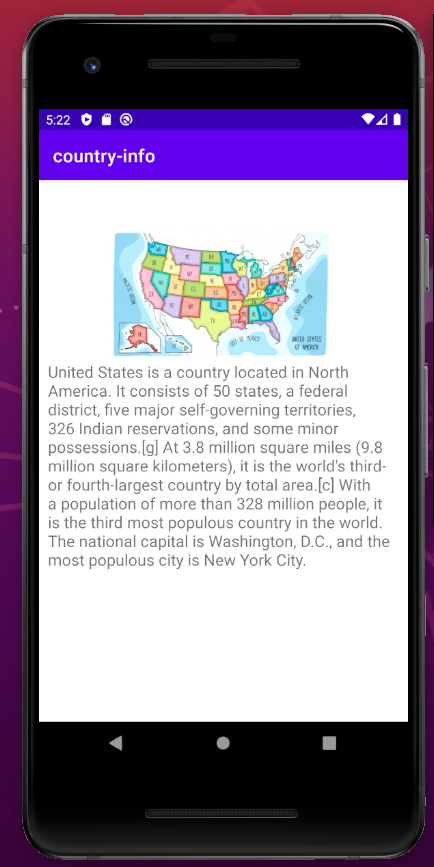

# kotlin-countries-info

### This is a simple app to practice the use of 2 different activities. Using an instance of Intent class.

In this app, you could see how to send (putExtra) from MainActivity to DetailsActivity.

As well you will see how to receive data from MainActivity, using get. 

---

*** Note: Please, remember use these pluggins in the file build.gradle:

```
plugins {
    id 'com.android.application'
    id 'kotlin-android'
    id 'kotlin-android-extensions'
}
```

---

## Images







---

## Author
* **Daniela Ramirez Gomez** - [danyramirezg](https://github.com/danyramirezg)
